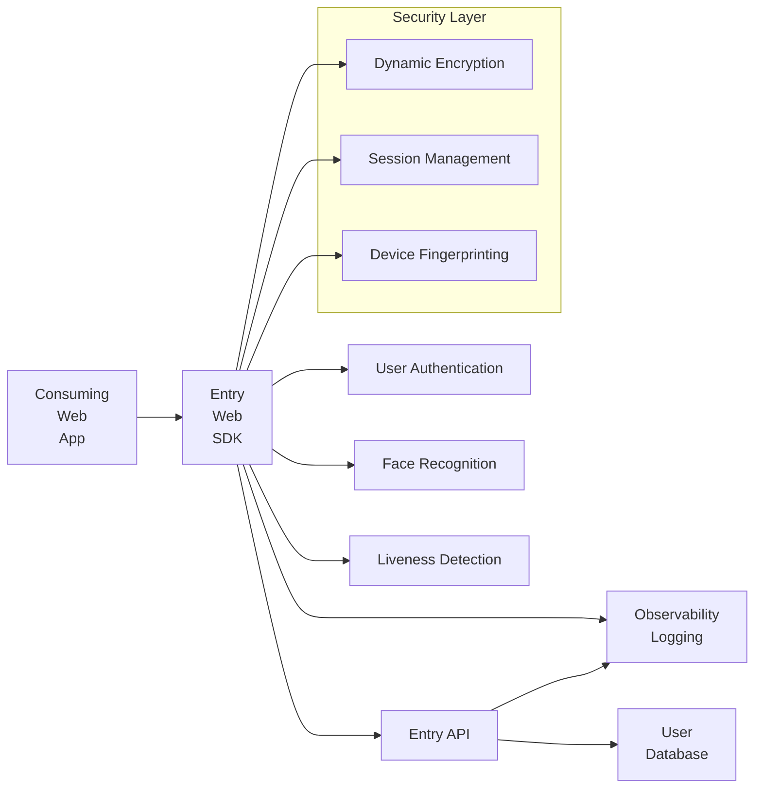
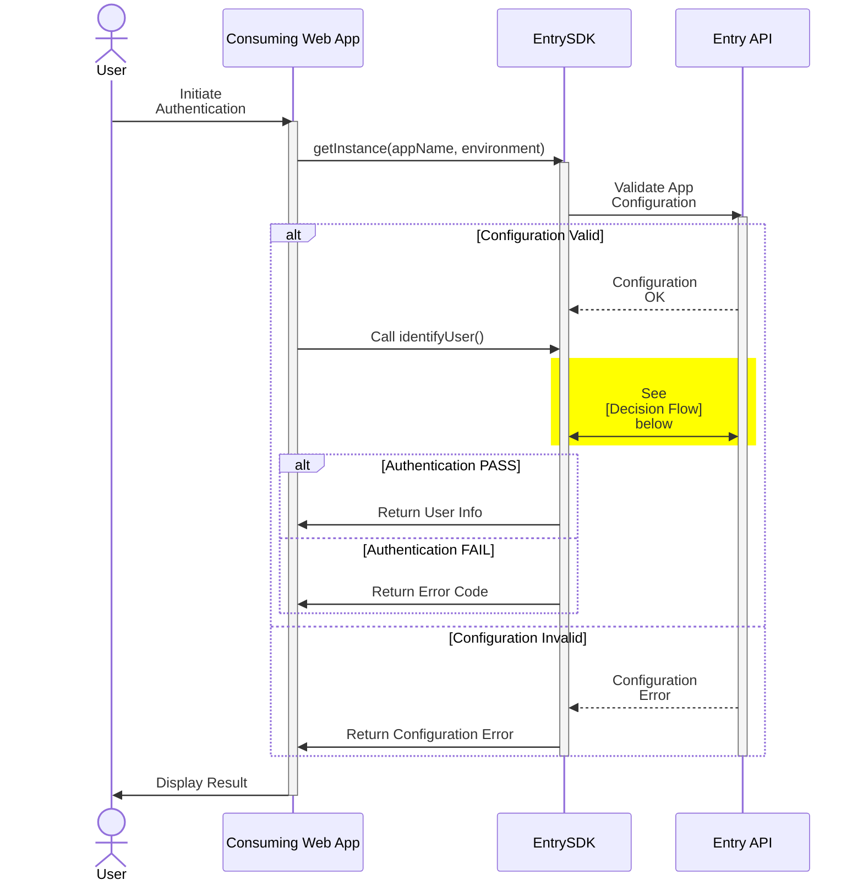
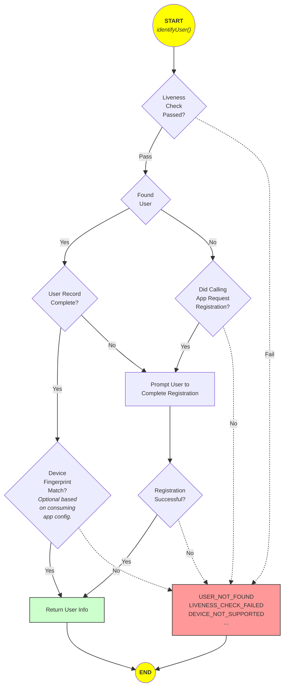

# Entry Web SDK Integration Guide

**Complete integration documentation for the Entry Web SDK** - A TypeScript SDK for secure biometric authentication using AWS Amplify and Rekognition.

## Quick Links

- **[Use Cases & Patterns](./use-cases)** - Common use cases and implementation patterns
- **[Error Handling Guide](./error-handling)** - Complete error handling reference
- **[Security & Compliance](./security)** - Security features and compliance guide

---

## Table of Contents

- [Quick Links](#quick-links)
- [Table of Contents](#table-of-contents)
- [Installation \& Setup](#installation--setup)
- [Technical Overview](#technical-overview)
- [Use Cases](#use-cases)
- [Security \& Compliance](#security--compliance)
- [Edge Cases \& Troubleshooting](#edge-cases--troubleshooting)
- [Integration Steps](#integration-steps)
- [SDK Reference](#sdk-reference)
- [Conclusion](#conclusion)

---

## Installation & Setup

### Installation Prerequisites

- Node.js 18+
- GitHub Personal Access Token with `read:packages` scope
- HTTPS-enabled application (required for camera access)
- Modern browser (Chrome 80+, Firefox 75+, Safari 13+, Edge 80+)

---

## Technical Overview

### Architecture



### Entry SDK Flow

#### Call Sequence



#### Decision Flow



---

### System Requirements

#### Minimum Requirements

- **Browsers**: Chrome 80+, Firefox 75+, Safari 13+, Edge 80+
- **Camera**: 720p resolution minimum
- **HTTPS**: Required for camera access

---

## Use Cases

The Entry Web SDK supports a wide range of authentication and identity verification use cases. For detailed use cases, implementation patterns, and code examples, see the **[Use Cases & Patterns Guide](./use-cases)**.

**Primary use cases include:**

- Secure user onboarding and biometric enrollment
- Passwordless authentication
- High-security transaction verification
- Multi-device session synchronization
- Healthcare and financial services compliance (HIPAA, PCI DSS)
- E-commerce fraud prevention
- Age verification for restricted content

---

## Security & Compliance

The SDK implements enterprise-grade security features including end-to-end encryption, AWS Rekognition liveness detection, and comprehensive audit logging.

For complete security documentation, compliance considerations, and best practices, see the **[Security & Compliance Guide](./security)**.

**Key security features:**

- AES-256-GCM encryption
- AWS Rekognition iBeta Level 2 certified liveness detection
- Device fingerprinting
- Session management with daily key rotation
- GDPR-ready with built-in privacy features

---

## Edge Cases & Troubleshooting

For comprehensive troubleshooting guidance, common edge cases, and error handling strategies, see the **[Error Handling Guide](./error-handling)**.

**Common scenarios covered:**

- Environmental factors (lighting, camera quality)
- Network connectivity issues
- Browser permissions and compatibility
- Framework-specific integration challenges
- Security and compliance edge cases

---

## Integration Steps

### Prerequisites

Before integrating the Entry Web SDK, ensure you have:

1. **Node.js** 18+ installed
2. **npm** 7+ or **Yarn** 1.22+
3. **HTTPS** enabled domain (required for camera access)
4. **Entry Consumer Configuration** from Synapser
5. **GitHub Personal Access Token** with `read:packages` scope

See the [home page](./) for installation instructions.

### Step 1: Consumer Configuration

Contact Synapser support to obtain your Entry Consumer configuration details, including your application name, domain and IP Whitelist requirements.

### Step 2: Installation

```bash
npm install @synapser/entry-web-sdk
```

### Step 3: Basic Setup

```typescript
// main.ts or index.ts
import { EntrySDK, EntryApiEnvironment } from '@synapser/entry-web-sdk';

// Initialize SDK
const entrySDK = EntrySDK.getInstance(
  'your-app-name',
  EntryApiEnvironment.Production // or .Test or .Demo for development
);
```

### Step 4: User Registration

```typescript
import { EntrySDK, EntrySDKError, EntrySDKErrorCode, EntryApiEnvironment } from '@synapser-limited/entry-web-sdk';

// Register new user
async function registerUser() {
  try {
    const entrySDK = EntrySDK.getInstance('your-app-name', EntryApiEnvironment.Live);
    const overlayElement = document.getElementById('entry-overlay');
    const user = await entrySDK.identifyUser(
      true, // registerIfNotFound
      overlayElement
    );
    
    console.log('User registered:', user);
    // Handle successful registration
    displayWelcomeMessage(user);
  } catch (error) {
    // Log full error details to console
    console.error('Registration failed:', error);
    
    // Handle typed errors
    if (error instanceof EntrySDKError) {
      switch (error.code) {
        case EntrySDKErrorCode.CAMERA_ACCESS_DENIED:
          showCameraPermissionInstructions();
          break;
        case EntrySDKErrorCode.LIVENESS_CHECK_FAILED:
          if (error.isRetryable()) {
            showRetryButton('Liveness check failed. Please try again.');
          }
          break;
        case EntrySDKErrorCode.NETWORK_ERROR:
          showOfflineMessage();
          break;
        default:
          showErrorMessage(error.message);
      }
    }
  }
}
```

### Step 5: User Authentication

```typescript
// Authenticate existing user
async function authenticateUser() {
  try {
    const entrySDK = EntrySDK.getInstance('your-app-name', EntryApiEnvironment.Live);
    const overlayElement = document.getElementById('entry-overlay');
    const user = await entrySDK.identifyUser(
      false, // registerIfNotFound
      overlayElement
    );
    
    console.log('User authenticated:', user);
    // Handle successful authentication
    redirectToDashboard(user);
  } catch (error) {
    // Log full error details to console
    console.error('Authentication failed:', error);
    
    // Handle typed errors
    if (error instanceof EntrySDKError) {
      switch (error.code) {
        case EntrySDKErrorCode.USER_NOT_FOUND:
          promptUserRegistration();
          break;
        case EntrySDKErrorCode.LIVENESS_CHECK_FAILED:
          showLivenessTips();
          break;
        case EntrySDKErrorCode.USER_CANCELLED:
          // User intentionally cancelled
          showLoginOptions();
          break;
        default:
          showErrorMessage(`Authentication failed: ${error.message}`);
      }
    }
  }
}
```

### Step 6: HTML Structure

```html
<!DOCTYPE html>
<html>
<head>
    <title>Your App</title>
</head>
<body>
    <div id="app">
        <button onclick="registerUser()">Register</button>
        <button onclick="authenticateUser()">Login</button>
        
        <!-- Entry SDK overlay container -->
        <div id="entry-overlay"></div>
    </div>
    
    <script src="your-app.js"></script>
</body>
</html>
```

### Advanced Integration Patterns

#### React Integration

```tsx
import React, { useCallback, useState } from 'react';
import { 
  EntrySDK, 
  EntryUser, 
  EntrySDKError,
  EntrySDKErrorCode,
  EntryApiEnvironment 
} from '@synapser-limited/entry-web-sdk';

const AuthComponent: React.FC = () => {
  const [user, setUser] = useState<EntryUser | null>(null);
  const [loading, setLoading] = useState(false);
  const [error, setError] = useState<string | null>(null);

  const handleAuthentication = useCallback(async (register: boolean) => {
    setLoading(true);
    setError(null);
    
    try {
      const entrySDK = EntrySDK.getInstance('your-app', EntryApiEnvironment.Live);
      const overlayElement = document.getElementById('entry-overlay');
      
      if (!overlayElement) {
        throw new Error('Entry overlay element not found');
      }
      
      const authenticatedUser = await entrySDK.identifyUser(register, overlayElement);
      setUser(authenticatedUser);
    } catch (err) {
      // Log full error to console
      console.error('Authentication error:', err);
      
      // Handle typed errors
      if (err instanceof EntrySDKError) {
        switch (err.code) {
          case EntrySDKErrorCode.USER_NOT_FOUND:
            setError('User not found.');
            break;
          case EntrySDKErrorCode.CAMERA_ACCESS_DENIED:
            setError('Camera access is required. Please enable camera permissions.');
            break;
          case EntrySDKErrorCode.LIVENESS_CHECK_FAILED:
            setError('Face verification failed. Please try again.');
            break;
          case EntrySDKErrorCode.NETWORK_ERROR:
            setError('Network connection failed. Please check your internet.');
            break;
          case EntrySDKErrorCode.USER_CANCELLED:
            setError('Authentication cancelled.');
            break;
          default:
            setError(`Authentication error: ${err.message}`);
        }
      } else {
        setError('An unexpected error occurred.');
      }
    } finally {
      setLoading(false);
    }
  }, []);

  return (
    <div>
      {error && (
        <div style={{ color: 'red', marginBottom: '1rem' }}>
          {error}
        </div>
      )}
      
      {user ? (
        <div>Welcome, {user.firstName} {user.lastName}!</div>
      ) : (
        <div>
          <button 
            onClick={() => handleAuthentication(false)}
            disabled={loading}
          >
            {loading ? 'Authenticating...' : 'Login'}
          </button>
          <button 
            onClick={() => handleAuthentication(true)}
            disabled={loading}
          >
            {loading ? 'Registering...' : 'Register'}
          </button>
        </div>
      )}
      <div id="entry-overlay"></div>
    </div>
  );
};

export default AuthComponent;
```

#### Vue.js Integration

```vue
<template>
  <div>
    <div v-if="user">
      Welcome, {{ user.firstName }} {{ user.lastName }}!
    </div>
    <div v-else>
      <button @click="authenticate(false)" :disabled="loading">
        {{ loading ? 'Authenticating...' : 'Login' }}
      </button>
      <button @click="authenticate(true)" :disabled="loading">
        {{ loading ? 'Registering...' : 'Register' }}
      </button>
    </div>
    <div id="entry-overlay"></div>
  </div>
</template>

<script>
import { EntrySDK, EntryApiEnvironment } from '@synapser/entry-web-sdk';

export default {
  data() {
    return {
      user: null,
      loading: false
    };
  },
  methods: {
    async authenticate(register) {
      this.loading = true;
      try {
        const entrySDK = EntrySDK.getInstance('your-app', EntryApiEnvironment.Production);
        const overlayElement = document.getElementById('entry-overlay');
        
        this.user = await entrySDK.identifyUser(register, overlayElement);
      } catch (error) {
        console.error('Authentication error:', error);
      } finally {
        this.loading = false;
      }
    }
  }
};
</script>
```

---

## SDK Reference

### EntrySDK Class

#### Static Methods

##### `getInstance(appName: string, environment: EntryApiEnvironment): EntrySDK`

Gets the singleton instance of the Entry SDK.

**Parameters:**

- `appName` (string): Your registered application name
- `environment` (EntryApiEnvironment): Target environment (Test/Demo/Production)

**Returns:** EntrySDK instance

**Example:**

```typescript
const sdk = EntrySDK.getInstance('com.mycompany.myapp', EntryApiEnvironment.Production);
```

#### Instance Methods

##### `identifyUser(registerIfNotFound: boolean, parentElement: HTMLElement): Promise<EntryUser>`

Identifies or registers a user using biometric authentication.

**Parameters:**

- `registerIfNotFound` (boolean): Whether to register if user not found
- `parentElement` (HTMLElement): DOM element to render the SDK interface

**Returns:** `Promise<EntryUser>` - User information

**Throws:** Error if authentication fails

**Example:**

```typescript
try {
  const user = await sdk.identifyUser(true, document.getElementById('entry-container'));
  console.log('User authenticated:', user);
} catch (error) {
  console.error('Authentication failed:', error.message);
}
```

### Data Types

#### EntryUser Interface

```typescript
interface EntryUser {
  entryUserId: string;                  // Unique Entry user identifier
  firstName: string;                    // User's first name
  lastName: string;                     // User's last name
  emailAddress: string;                 // User's email address
  mobileNumber: string;                 // User's mobile number
  dateOfBirth: string;                  // ISO 8601 format date
  gender: string;                       // "M" or "F"
  nationalityCountryCodeIso: string;    // ISO 3166-1 alpha-2 code
  photoIdentityDocumentType: string;    // "IdBook", "Passport", etc.
  photoIdentityDocumentNumber: string;  // Document number
  deviceId: string;                     // Device identifier
  isRegistrationComplete: boolean;      // Registration status
}
```

#### EntryApiEnvironment Enum

```typescript
enum EntryApiEnvironment {
  Test = 'test',
  Demo = 'demo',
  Production = 'production'
}
```

### Error Handling

The SDK provides a comprehensive typed error handling system with `EntrySDKError` and standardized error codes.

#### Basic Error Handling

```typescript
import { EntrySDK, EntrySDKError, EntrySDKErrorCode, EntryApiEnvironment } from '@synapser-limited/entry-web-sdk';

try {
  const sdk = EntrySDK.getInstance('your-app', EntryApiEnvironment.Live);
  const user = await sdk.identifyUser(false, element);
} catch (error) {
  // Log full error details to console for debugging
  console.error('SDK Error:', error);
  
  // Handle typed SDK errors
  if (error instanceof EntrySDKError) {
    console.log('Error Code:', error.code);
    console.log('Error Message:', error.message);
    console.log('Retryable:', error.isRetryable());
    
    // Handle specific error codes
    switch (error.code) {
      case EntrySDKErrorCode.USER_NOT_FOUND:
        // Prompt user registration
        break;
      case EntrySDKErrorCode.CAMERA_ACCESS_DENIED:
        // Show camera permission guide
        break;
      case EntrySDKErrorCode.LIVENESS_CHECK_FAILED:
        // Allow retry with tips
        break;
      case EntrySDKErrorCode.NETWORK_ERROR:
        // Show offline message
        break;
      default:
        // Generic error handling
        showError(error.message);
    }
  }
}
```

#### EntrySDKError Properties

```typescript
error.code          // EntrySDKErrorCode enum
error.message       // Human-readable error message
error.statusCode    // HTTP status code (if API error)
error.retryable     // Boolean - can operation be retried?
error.context       // Additional context data
error.cause         // Original error (if wrapped)
error.timestamp     // When the error occurred
```

#### Helper Methods

```typescript
error.isRetryable()           // Returns true if error can be retried
error.isCode(code)            // Check if error matches specific code
error.toJSON()                // Serialize error to JSON
error.toString()              // Get formatted string representation
```

#### Common Error Codes

| Error Code | Description | Retryable | Typical Action |
|------------|-------------|-----------|----------------|
| `USER_NOT_FOUND` | User doesn't exist | No | Prompt registration |
| `LIVENESS_CHECK_FAILED` | Face verification failed | Yes | Show retry with tips |
| `CAMERA_ACCESS_DENIED` | Camera permission denied | Yes | Guide to enable camera |
| `NETWORK_ERROR` | Connection failed | Yes | Show offline message |
| `INVALID_CONFIGURATION` | SDK config error | No | Contact support |
| `DEVICE_NOT_SUPPORTED` | Device incompatible | No | Show requirements |
| `USER_CANCELLED` | User cancelled | Yes | Return to login |
| `TIMEOUT_ERROR` | Request timed out | Yes | Retry operation |
| `SESSION_EXPIRED` | Session expired | Yes | Restart flow |
| `FACE_MATCH_FAILED` | Face doesn't match | Yes | Try again |
| `MULTIPLE_FACES_DETECTED` | Multiple faces found | Yes | Ensure one person |
| `UNKNOWN_ERROR` | Unexpected error | No | Log and contact support |

#### Retry Pattern for Retryable Errors

```typescript
async function authenticateWithRetry(maxAttempts = 3) {
  for (let attempt = 1; attempt <= maxAttempts; attempt++) {
    try {
      const sdk = EntrySDK.getInstance('your-app', EntryApiEnvironment.Live);
      return await sdk.identifyUser(true, element);
    } catch (error) {
      console.error(`Attempt ${attempt} failed:`, error);
      
      if (error instanceof EntrySDKError) {
        // Only retry if error is retryable and not last attempt
        if (!error.isRetryable() || attempt === maxAttempts) {
          throw error;
        }
        
        // Wait before retrying (exponential backoff)
        await new Promise(resolve => 
          setTimeout(resolve, Math.pow(2, attempt) * 1000)
        );
      } else {
        throw error;
      }
    }
  }
}
```

#### User-Friendly Error Messages

```typescript
function getUserFriendlyMessage(error: EntrySDKError): string {
  const messages: Record<EntrySDKErrorCode, string> = {
    [EntrySDKErrorCode.USER_NOT_FOUND]: 
      'We couldn\'t find your account.',
    [EntrySDKErrorCode.CAMERA_ACCESS_DENIED]: 
      'Camera access is required. Please enable it in your browser settings.',
    [EntrySDKErrorCode.LIVENESS_CHECK_FAILED]: 
      'We couldn\'t verify your identity. Please ensure your face is clearly visible.',
    [EntrySDKErrorCode.NETWORK_ERROR]: 
      'Connection lost. Please check your internet and try again.',
    [EntrySDKErrorCode.USER_CANCELLED]: 
      'Authentication cancelled. Would you like to try again?',
    // Add more mappings as needed
  };
  
  return messages[error.code] || error.message;
}

// Usage
try {
  await sdk.identifyUser(true, element);
} catch (error) {
  if (error instanceof EntrySDKError) {
    displayErrorToUser(getUserFriendlyMessage(error));
  }
}
```

For complete error handling documentation with more examples and best practices, see the **[Error Handling Guide](./ERROR-HANDLING.md)**.

---

## Conclusion

The Entry Web SDK provides a comprehensive solution for implementing secure biometric authentication in web applications. With its robust feature set, enterprise-grade security, and developer-friendly integration process, it enables organizations to deliver passwordless authentication experiences that users love while meeting the highest security standards.

For additional support or questions, please don't hesitate to contact our team at <support@synapser.com>.

---

*© 2025 Synapser Limited. All rights reserved.*
